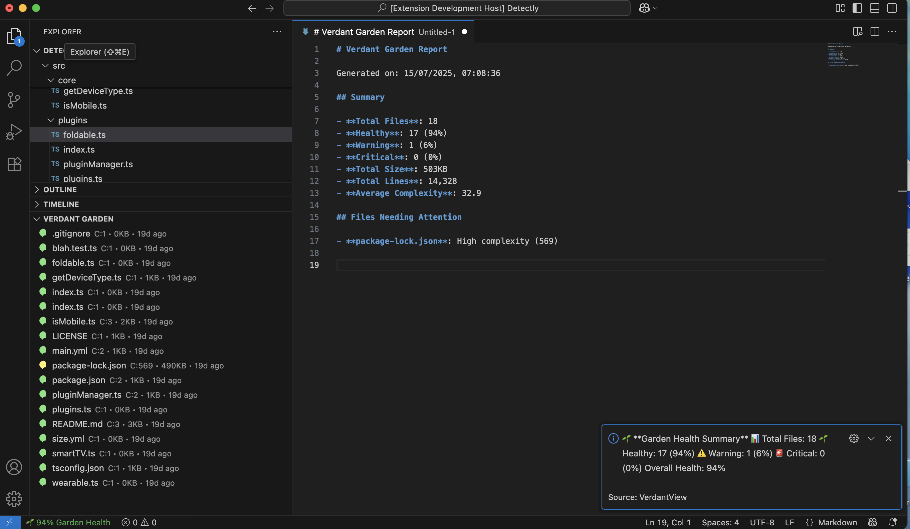

# 🌱 VerdantView - Visualize Your Codebase as a Living Garden

Transform your codebase into a beautiful, living garden where each file is represented as a plant with health indicators, complexity metrics, and intelligent insights.

<div align="center">
  
</div>

## ✨ Features

### ✨ Instant Change Detection
- **Real-time Updates**: Garden automatically refreshes when files are created, modified, or deleted
- **Smart Filtering**: Ignores temporary and cache files to prevent unnecessary updates
- **Configurable Debouncing**: Adjustable delay to batch multiple changes together
- **Toggle Control**: Enable/disable file watching as needed
- **Change Notifications**: Optional notifications when files change (sprouted/grew/withered)

### 🌿 Comprehensive File Support
- **All File Types**: Supports TypeScript, JavaScript, Python, Java, C++, CSS, HTML, JSON, Markdown, and 30+ other file types
- **Smart Detection**: Automatically identifies file types and applies appropriate analysis
- **Custom Icons**: Beautiful, themed icons for different file types and health states

### 📊 Advanced File Analysis
- **Complexity Scoring**: Intelligent complexity analysis based on code patterns
- **Health Assessment**: Files are categorized as Healthy 🌱, Warning ⚠️, or Critical 🚨
- **Size Metrics**: Track file sizes and line counts
- **Freshness Tracking**: See when files were last modified

### 🎯 Powerful Organization
- **Group by Type**: Organize files by programming language or file type
- **Group by Health**: Quickly identify files needing attention
- **Group by Folder**: Navigate your project structure
- **Health Filtering**: Focus on specific health categories

### 🛠️ Rich Interactions
- **Detailed Tooltips**: Hover for comprehensive file information
- **Metrics Dashboard**: Click to see detailed analytics in a beautiful webview
- **One-Click Navigation**: Click any file to open it instantly
- **Garden Reports**: Export comprehensive health reports
- **Status Bar Integration**: Live garden health percentage in the status bar
- **Instant Feedback**: Real-time garden updates as you work

### ⚙️ Configurable Settings
- **Custom Thresholds**: Set your own complexity and size warning levels
- **Include/Exclude Patterns**: Control which files appear in your garden
- **Auto-Refresh**: Optional automatic garden updates
- **Metric Display**: Choose which metrics to show in the tree view

## 🚀 Quick Start

1. **Install the Extension**: Open VS Code Extensions and search for "VerdantView"
2. **Open Your Project**: The garden will automatically appear in the Explorer panel
3. **Explore Your Garden**: Browse files, check health status, and dive into metrics
4. **Customize Settings**: Access settings via the gear icon in the garden toolbar

## 🎮 Commands

- **Refresh Garden** (`Ctrl+Shift+P` → "VerdantView: Refresh"): Update your garden
- **Filter by Health**: Show only healthy, warning, or critical files
- **Group Files**: Organize by type, health, or folder structure
- **Export Report**: Generate a comprehensive markdown report
- **Analyze File**: View detailed metrics for any file
- **Garden Settings**: Quick access to extension configuration
- **Toggle File Watching**: Enable/disable instant change detection
- **Garden Summary**: Click status bar for health overview

## 📈 Health Indicators

### 🌱 Healthy Files
- Low complexity
- Reasonable size
- Recently modified
- No detected issues

### ⚠️ Warning Files
- Moderate complexity or size
- Minor issues detected
- May need attention

### 🚨 Critical Files
- High complexity
- Large file size
- Multiple issues
- Requires immediate attention

## ⚙️ Configuration

Access settings via VS Code Settings → Extensions → Verdant Garden:

```json
{
  "verdantView.excludePatterns": [
    "**/node_modules/**",
    "**/dist/**",
    "**/build/**"
  ],
  "verdantView.healthThresholds": {
    "complexity": { "warning": 10, "critical": 20 },
    "size": { "warning": 500, "critical": 1000 },
    "age": { "warning": 30, "critical": 90 }
  },
  "verdantView.showMetrics": [
    "complexity",
    "size", 
    "lastModified"
  ],
  "verdantView.groupBy": "none",
  "verdantView.refreshInterval": 0,
  "verdantView.enableFileWatching": true,
  "verdantView.showChangeNotifications": false,
  "verdantView.debounceDelay": 300
}
```

## 🎨 File Type Support

VerdantView recognizes and provides specialized analysis for:

**Programming Languages**: TypeScript, JavaScript, Python, Java, C++, C#, PHP, Ruby, Go, Rust, Swift, Kotlin, Scala, Dart

**Web Technologies**: HTML, CSS, SCSS, SASS, LESS, Vue, Svelte

**Data Formats**: JSON, XML, YAML, TOML, CSV

**Documentation**: Markdown, Text, LaTeX

**Configuration**: ENV, INI, Config files

**Build Tools**: Dockerfile, Makefile, package.json, pom.xml

**And Many More**: Images, Databases, Logs, and custom file types

## 🔧 Advanced Features

### Garden Reports
Generate comprehensive reports with:
- Overall health statistics
- File type distribution
- Complexity trends
- Files requiring attention
- Project health overview

### Smart Grouping
Organize your garden by:
- **File Type**: Group similar technologies together
- **Health Status**: Focus on problematic areas
- **Folder Structure**: Maintain project organization
- **Custom Categories**: Define your own grouping logic

### Interactive Metrics
Click any file to see:
- Detailed complexity breakdown
- Size and line count trends
- Health assessment reasoning
- Modification history
- Issue recommendations

## 🤝 Contributing

We welcome contributions! Please see our [Contributing Guide](CONTRIBUTING.md) for details.

## 📄 License

This extension is licensed under the [MIT License](LICENSE).

## 🌟 Support

- 📝 [Report Issues](https://github.com/your-repo/verdantview/issues)
- 💬 [Discussions](https://github.com/your-repo/verdantview/discussions)
- 📧 [Contact](mailto:support@verdantview.dev)

---

**Happy Gardening! 🌱** Turn your codebase into a thriving garden with VerdantView.
